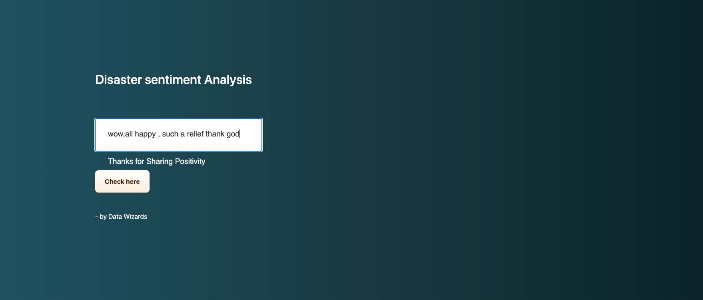
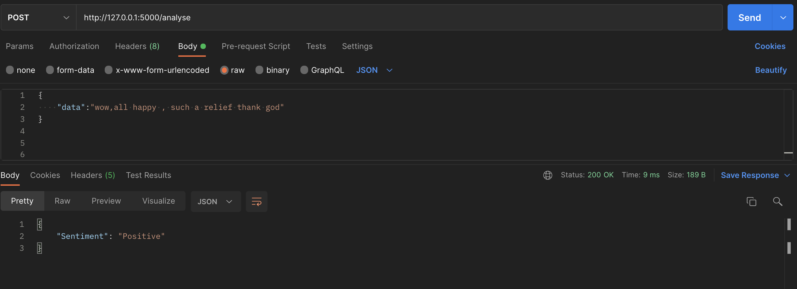

[![MIT License][license-shield]][license-url]
[![LinkedIn][linkedin-shield]][linkedin-url]


<!-- PROJECT LOGO -->
<br />
<p align="center">

  <h3 align="center">Disaster Sentiment Analysis</h3>

  <p align="center">
    We all tweet our thoughts without thinking whether they carry positive or negative sentiment.
This app by Data Wizards will allow user to analyse their text/tweet if it has a Positive or negative sentiments involved in terms of Disasters around the world.
    <br />
    <br />
    <a href="https://disasterapp.herokuapp.com/movies">View Demo</a>
    ·
    <a href="https://github.com/LondheShubham153/">Report Bug</a>
    ·
    <a href="https://github.com/LondheShubham153/">Request Feature</a>
  </p>
</p>


<!-- TABLE OF CONTENTS -->
## Table of Contents

* [About the Project](#about-the-project)
  * [Built With](#built-with)
* [Getting Started](#getting-started)
  * [Prerequisites](#prerequisites)
  * [Installation](#installation)
* [Usage](#usage)
* [Roadmap](#roadmap)
* [Contributing](#contributing)
* [License](#license)
* [Contact](#contact)


<!-- ABOUT THE PROJECT -->
## About The Project





### Built With
This application is built with love, dedication, coffee and:
* [sklearn](https://pypi.org/project/aiohttp/)
* [nlp](https://www.sqlite.org/index.html)


<!-- GETTING STARTED -->
## Getting Started

To get a local copy up and running follow these simple example steps.

### Prerequisites


* python
```sh
python --version
```

### Installation

1. Get a free API Key at [https://www.linkedin.com/in/shubhamlondhe1996/](https://www.linkedin.com/in/shubhamlondhe1996/)
2. Clone the repo
```sh
git clone https://github.com/LondheShubham153/aston_sit_hackathon_nlp_track
```
3. Install python packages
```sh
pip install -r requirements.txt
```
4. Test the application
```python
pytest
```
5. Run the application
```python
python app.py
```


<!-- USAGE EXAMPLES -->
## Usage

_For more examples, please refer to the [Documentation](https://github.com/LondheShubham153/aston_sit_hackathon_nlp_track)_


<!-- ROADMAP -->
## Roadmap

See the [open issues](https://github.com/LondheShubham153/aston_sit_hackathon_nlp_track/issues) for a list of proposed features (and known issues).


<!-- CONTRIBUTING -->
## Contributing

Contributions are what make the open source community such an amazing place to be learn, inspire, and create. Any contributions you make are **greatly appreciated**.

1. Fork the Project
2. Create your Feature Branch (`git checkout -b feature/AmazingFeature`)
3. Commit your Changes (`git commit -m 'Add some AmazingFeature'`)
4. Push to the Branch (`git push origin feature/AmazingFeature`)
5. Open a Pull Request


<!-- LICENSE -->
## License

Distributed under the MIT License. See `LICENSE` for more information.


<!-- CONTACT -->
## Contact

Shubham Londhe - [shubhamlondhe1996](https://www.linkedin.com/in/shubhamlondhe1996/) - My LinkedIn


<!-- MARKDOWN LINKS & IMAGES -->
<!-- https://www.markdownguide.org/basic-syntax/#reference-style-links -->

[license-shield]: https://img.shields.io/github/license/othneildrew/Best-README-Template.svg?style=flat-square
[license-url]: https://github.com/othneildrew/Best-README-Template/blob/master/LICENSE.txt
[linkedin-shield]: https://img.shields.io/badge/-LinkedIn-black.svg?style=flat-square&logo=linkedin&colorB=555
[linkedin-url]: https://www.linkedin.com/in/shubhamlondhe1996/
[product-screenshot]: images/search.png